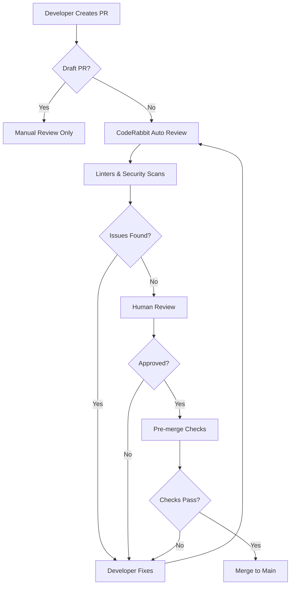

# CodeRabbit Best Practices & Review Instructions Research
## Agent 4 Deliverable - KellerAI Implementation Guide

**Research Date:** October 14, 2025  
**Research Scope:** CodeRabbit organizational review standards, best practices, and enterprise implementations  
**Target Organization:** KellerAI

---

## Executive Summary

This comprehensive research document compiles proven CodeRabbit review standards, best practices, and real-world implementations tailored for KellerAI's enterprise AI development environment. Based on official documentation, community implementations, and security-focused patterns, this guide provides actionable frameworks for code review excellence.

### Key Findings
- **Path-based instructions** enable file-type-specific review guidelines with glob pattern support
- **AST-grep rules** provide advanced code pattern detection with security-focused rule sets
- **Tone instructions** standardize professional team communication (250 char limit)
- **Pre-merge checks** enforce quality gates with configurable thresholds (docstring coverage, title/description validation)
- **Real-world implementations** from Appsmith, Novu, and OpenObserve demonstrate enterprise patterns

---

## 1. KellerAI-Specific Review Instructions Template

### 1.1 Enterprise Configuration Framework

```yaml
# .coderabbit.yaml - KellerAI Enterprise Configuration
language: "en-US"
tone_instructions: "You are an expert code reviewer in Python, TypeScript, JavaScript, and AI/ML systems. You work in an enterprise AI software developer team, providing concise and clear code review advice focused on security, performance, and maintainability."

reviews:
  profile: "assertive"  # More thorough feedback for enterprise standards
  request_changes_workflow: true  # Require comment resolution before approval
  high_level_summary: true
  high_level_summary_placeholder: "@coderabbitai summary"
  poem: false  # Professional enterprise environment
  
  # Review automation
  auto_review:
    enabled: true
    auto_incremental_review: true
    drafts: false  # Only review ready PRs
    base_branches: ["main", "develop", "release/*"]
    ignore_title_keywords: ["WIP", "[skip ci]", "DO NOT MERGE"]
  
  # Quality gates
  pre_merge_checks:
    docstrings:
      mode: "warning"  # Start with warnings, escalate to error
      threshold: 80
    title:
      mode: "warning"
      requirements: "Title should be concise, descriptive, and follow conventional commits format (feat:, fix:, docs:, etc.)"
    description:
      mode: "warning"
    issue_assessment:
      mode: "warning"
  
  # Walkthrough customization
  collapse_walkthrough: false
  changed_files_summary: true
  sequence_diagrams: true
  estimate_code_review_effort: true
  assess_linked_issues: true
  related_issues: true
  related_prs: true
  suggested_labels: true
  auto_apply_labels: false  # Manual label approval
  suggested_reviewers: true
  auto_assign_reviewers: false

  # Path-based review instructions
  path_instructions:
    # Python AI/ML Code
    - path: "**/*.py"
      instructions: |
        Review Python code with focus on:
        - PEP 8 compliance and type hints
        - Proper exception handling and logging
        - Security: SQL injection, command injection, insecure deserialization
        - Performance: Efficient data structures, avoid nested loops
        - AI/ML specific: Model validation, data preprocessing, reproducibility
        - Documentation: Docstrings for all public functions/classes
        
    # TypeScript/JavaScript Frontend
    - path: "**/*.{ts,tsx,js,jsx}"
      instructions: |
        Review TypeScript/JavaScript code against:
        - ESLint configuration and best practices
        - Type safety: Avoid 'any', use proper interfaces
        - React patterns: Hooks best practices, component composition
        - Security: XSS prevention, input validation, secure API calls
        - Performance: Memoization, lazy loading, bundle size
        - Accessibility: ARIA labels, semantic HTML, keyboard navigation
        
    # Test Files
    - path: "**/*.{test,spec}.{ts,js,py}"
      instructions: |
        Review test code ensuring:
        - Comprehensive coverage (>80% for critical paths)
        - Clear test names describing what is tested
        - Proper test isolation and no test interdependencies
        - Mock external dependencies appropriately
        - Test edge cases and error conditions
        - Follow AAA pattern: Arrange, Act, Assert
        
    # API/Backend Routes
    - path: "**/api/**/*.{py,ts,js}"
      instructions: |
        Review API code with strict focus on:
        - Input validation and sanitization
        - Authentication and authorization checks
        - Rate limiting and request throttling
        - Proper error responses (don't leak stack traces)
        - API versioning and backward compatibility
        - OpenAPI/Swagger documentation
        
    # Database/Models
    - path: "**/{models,schemas,migrations}/**/*.py"
      instructions: |
        Review database code focusing on:
        - SQL injection prevention (parameterized queries)
        - Proper indexing for query performance
        - Migration safety (reversible, no data loss)
        - Schema validation and constraints
        - Connection pooling and transaction management
        
    # Configuration Files
    - path: "**/*.{yaml,yml,json,env.example}"
      instructions: |
        Review configuration files ensuring:
        - No hardcoded secrets or credentials
        - Proper environment variable usage
        - Schema validation where applicable
        - Documentation of configuration options
        - Secure defaults
        
    # Infrastructure/DevOps
    - path: "**/{docker,k8s,terraform}/**/*"
      instructions: |
        Review infrastructure code for:
        - Security: Minimal base images, non-root users
        - Resource limits and health checks
        - Secrets management (use secrets managers)
        - High availability and fault tolerance
        - Cost optimization
        
    # Documentation
    - path: "**/*.md"
      instructions: |
        Review documentation ensuring:
        - Clear, concise, and accurate content
        - Up-to-date code examples
        - Proper formatting and structure
        - No broken links or outdated references
        - Security considerations documented

  # Path filters (files to review)
  path_filters:
    - "**/*.py"
    - "**/*.{ts,tsx,js,jsx}"
    - "**/*.{yaml,yml}"
    - "**/*.md"
    # Exclude patterns (use ! prefix)
    - "!**/node_modules/**"
    - "!**/dist/**"
    - "!**/build/**"
    - "!**/.venv/**"
    - "!**/migrations/**/*.py"  # Review migrations separately
    - "!**/package-lock.json"
    - "!**/yarn.lock"

  # Labeling instructions
  labeling_instructions:
    - label: "security"
      instructions: "Apply when PR addresses security vulnerabilities, implements authentication/authorization, or includes security hardening."
    - label: "performance"
      instructions: "Apply when PR optimizes algorithms, reduces database queries, improves response times, or reduces resource usage."
    - label: "breaking-change"
      instructions: "Apply when PR introduces breaking API changes, modifies database schema, or requires migration steps."
    - label: "ai-ml"
      instructions: "Apply when PR involves model training, inference optimization, data preprocessing, or AI/ML pipeline changes."
    - label: "frontend"
      instructions: "Apply when PR contains UI changes, React components, or frontend-specific code."
    - label: "backend"
      instructions: "Apply when PR modifies API endpoints, business logic, or backend services."
    - label: "documentation"
      instructions: "Apply when PR primarily updates documentation, README files, or code comments."
    - label: "dependencies"
      instructions: "Apply when PR updates third-party dependencies or adds new packages."

  # Tool integrations
  tools:
    # AST-grep for advanced pattern matching
    ast-grep:
      essential_rules: true  # Enable security-focused rules
      rule_dirs:
        - ".coderabbit/ast-grep-rules"  # Custom KellerAI rules
      packages:
        - "coderabbitai/ast-grep-essentials"  # Community security rules
    
    # Python linters
    ruff:
      enabled: true
    pylint:
      enabled: true
    flake8:
      enabled: false  # Ruff replaces flake8
    
    # JavaScript/TypeScript
    eslint:
      enabled: true
    oxc:
      enabled: true  # Fast Rust-based linter
    biome:
      enabled: true
    
    # Security scanners
    gitleaks:
      enabled: true  # Secret detection
    semgrep:
      enabled: true
      config_file: ".semgrep/config.yaml"
    
    # Shell scripts
    shellcheck:
      enabled: true
    
    # YAML
    yamllint:
      enabled: true
    
    # Markdown
    markdownlint:
      enabled: true
    
    # Infrastructure
    checkov:
      enabled: true  # IaC security
    hadolint:
      enabled: true  # Dockerfile linting
    
    # Language-specific
    languagetool:
      enabled: true
      level: "picky"
      disabled_categories: ["TYPOS", "TYPOGRAPHY"]
    
    # GitHub checks integration
    github-checks:
      enabled: true
      timeout_ms: 120000  # 2 minutes for CI/CD completion

# Chat configuration
chat:
  auto_reply: true
  art: false  # Professional environment
  integrations:
    jira:
      usage: "enabled"  # Enterprise issue tracking
    linear:
      usage: "disabled"

# Knowledge base
knowledge_base:
  opt_out: false
  web_search:
    enabled: true
  code_guidelines:
    enabled: true
    file_patterns:
      - "**/.cursorrules"
      - "**/CODING_STANDARDS.md"
      - "**/.github/DEVELOPMENT.md"
      - "**/SECURITY.md"
  learnings:
    scope: "global"  # Organization-wide learning
  issues:
    scope: "global"
  jira:
    usage: "enabled"
    project_keys: ["KELLER", "AI", "ML"]
  pull_requests:
    scope: "global"
  mcp:
    usage: "enabled"

# Code generation
code_generation:
  docstrings:
    language: "en-US"
    path_instructions:
      - path: "**/*.py"
        instructions: |
          Generate Google-style docstrings with:
          - Brief one-line summary
          - Detailed description (if needed)
          - Args: Type and description
          - Returns: Type and description
          - Raises: Exception types and conditions
          - Examples: For complex functions
  
  unit_tests:
    path_instructions:
      - path: "**/*.py"
        instructions: |
          Generate pytest tests with:
          - Fixtures for common setup
          - Parametrize for multiple test cases
          - Mock external dependencies
          - Test edge cases and error conditions
          - Clear assertions with descriptive messages
      - path: "**/*.{ts,tsx}"
        instructions: |
          Generate Jest/React Testing Library tests with:
          - Render components in isolation
          - Test user interactions
          - Mock API calls and external dependencies
          - Test accessibility
          - Snapshot tests for UI stability
```

---

## 2. Security and Compliance Checklist

### 2.1 OWASP Top 10 Review Patterns

```yaml
# .coderabbit/ast-grep-rules/security/owasp-patterns.yml
# Custom AST-grep rules for OWASP security patterns

# A01:2021 - Broken Access Control
rules:
  - id: missing-auth-check
    language: python
    pattern: |
      @app.route($PATH, methods=[$$$METHODS])
      def $FUNC($$$ARGS):
        $$$BODY
    not:
      inside:
        pattern: |
          @login_required
          @require_auth
    message: "Endpoint may be missing authentication check"
    severity: error
    
  - id: hardcoded-jwt-secret
    language: javascript
    pattern: jwt.sign($DATA, "$SECRET", $$$OPTIONS)
    message: "JWT secret should not be hardcoded - use environment variables"
    severity: error

# A02:2021 - Cryptographic Failures
  - id: weak-hash-algorithm
    language: python
    pattern: hashlib.md5($DATA)
    message: "MD5 is cryptographically broken - use SHA-256 or better"
    severity: error
    
  - id: insecure-random
    language: javascript
    pattern: Math.random()
    inside:
      any:
        - pattern: generateToken
        - pattern: createSecret
        - pattern: generatePassword
    message: "Math.random() is not cryptographically secure - use crypto.randomBytes()"
    severity: warning

# A03:2021 - Injection
  - id: sql-injection-risk
    language: python
    pattern: cursor.execute(f"$$$SQL {$VAR} $$$")
    message: "Potential SQL injection - use parameterized queries"
    severity: error
    
- id: command-injection
  language: python
  any:
    - pattern: os.system($CMD)
    - pattern: subprocess.call($CMD, shell=True)
  message: "Command injection risk - avoid shell=True and validate inputs"
  severity: error

# A04:2021 - Insecure Design
  - id: missing-rate-limiting
    language: python
    pattern: |
      @app.route("/api/$PATH", methods=["POST"])
      def $FUNC($$$):
        $$$
    not:
      inside:
        pattern: "@limiter.limit"
    message: "API endpoint may need rate limiting"
    severity: warning

# A05:2021 - Security Misconfiguration
  - id: debug-enabled-production
    language: python
    pattern: app.debug = True
    message: "Debug mode should be disabled in production"
    severity: error
    
  - id: cors-allow-all
    language: javascript
    pattern: cors({ origin: '*' })
    message: "CORS allowing all origins is insecure - specify allowed domains"
    severity: warning

# A06:2021 - Vulnerable Components
  # (Handled by dependency scanners like OSV-Scanner)

# A07:2021 - Authentication Failures
  - id: weak-password-validation
    language: python
    pattern: |
      def validate_password($PASS):
        return len($PASS) > $MIN
    message: "Password validation should check complexity, not just length"
    severity: warning

# A08:2021 - Software and Data Integrity
  - id: unverified-package-install
    language: dockerfile
    pattern: pip install $PACKAGE
    not:
      pattern: pip install $PACKAGE==$VERSION
    message: "Pin package versions to ensure reproducible builds"
    severity: warning

# A09:2021 - Security Logging Failures
  - id: missing-audit-log
    language: python
    pattern: |
      def delete_$RESOURCE($$$):
        $$$
    not:
      inside:
        pattern: logger.$LOG
    message: "Sensitive operations should be logged for audit trails"
    severity: warning

# A10:2021 - Server-Side Request Forgery
  - id: ssrf-risk
    language: python
    pattern: requests.get($USER_INPUT)
    message: "Potential SSRF - validate and whitelist URLs before making requests"
    severity: error
```

### 2.2 Security Review Checklist

**Authentication & Authorization**
- [ ] All API endpoints require authentication
- [ ] Authorization checks verify user permissions
- [ ] JWT tokens use secure secrets (env variables)
- [ ] Session management follows best practices
- [ ] Multi-factor authentication for sensitive operations

**Input Validation**
- [ ] All user inputs are validated and sanitized
- [ ] SQL queries use parameterized statements
- [ ] File uploads validate type, size, and content
- [ ] API rate limiting implemented
- [ ] Schema validation for API requests

**Data Protection**
- [ ] Sensitive data encrypted at rest
- [ ] TLS/HTTPS for data in transit
- [ ] No secrets in code or logs
- [ ] PII handling complies with regulations
- [ ] Secure password storage (bcrypt/Argon2)

**Error Handling**
- [ ] No sensitive information in error messages
- [ ] Stack traces disabled in production
- [ ] Proper HTTP status codes used
- [ ] Error logging includes context
- [ ] User-friendly error messages

**Dependencies**
- [ ] All dependencies pinned to versions
- [ ] Regular security updates applied
- [ ] Vulnerability scanning enabled
- [ ] License compliance verified
- [ ] Minimal dependency footprint

**Infrastructure**
- [ ] Container images from trusted sources
- [ ] Non-root users in containers
- [ ] Resource limits configured
- [ ] Secrets management solution used
- [ ] Network segmentation implemented

---

## 3. Tone Instructions Guide

### 3.1 Professional Communication Standards

CodeRabbit's `tone_instructions` field (max 250 characters) sets the review communication style.

**KellerAI Recommended Tones:**

#### Option 1: Enterprise Professional (Recommended)
```yaml
tone_instructions: "You are an expert code reviewer providing concise, actionable feedback. Focus on security, performance, and maintainability. Be direct but constructive, prioritizing critical issues over style preferences."
```

#### Option 2: Security-First
```yaml
tone_instructions: "Expert security-focused reviewer. Flag vulnerabilities immediately. Provide clear remediation steps. Be thorough with auth, crypto, and data protection. Concise but comprehensive on security issues."
```

#### Option 3: Senior Engineer Mentor
```yaml
tone_instructions: "Senior engineer providing mentorship through code review. Explain the 'why' behind suggestions. Share best practices and patterns. Be encouraging while maintaining high standards."
```

#### Option 4: AI/ML Specialist
```yaml
tone_instructions: "AI/ML expert reviewer. Focus on model validation, data preprocessing, performance optimization, and reproducibility. Technical depth for ML systems with practical implementation guidance."
```

**Anti-Patterns to Avoid:**
- ❌ Too casual: "Yo, this code is kinda sus ngl"
- ❌ Too verbose: "Perhaps you might consider..."
- ❌ Too aggressive: "This is terrible code"
- ❌ Emoji-heavy: "Great job! 🎉🚀✨"

**Best Practices:**
- ✅ Be specific: Reference line numbers and code snippets
- ✅ Provide examples: Show correct implementation
- ✅ Explain impact: "This could cause N+1 queries"
- ✅ Prioritize: "Critical: SQL injection risk"
- ✅ Be consistent: Maintain same tone across reviews

---

## 4. Review Workflow Best Practices

### 4.1 Optimal Pull Request Flow



### 4.2 Recommended Workflows

**Small PRs (< 300 lines):**
1. Developer opens PR
2. CodeRabbit reviews within 2-3 minutes
3. Automated tests run in parallel
4. Developer addresses feedback
5. Single human reviewer approves
6. Merge on green CI

**Medium PRs (300-1000 lines):**
1. Developer opens draft PR
2. Use `@coderabbitai pause` during active development
3. Mark ready for review when stable
4. CodeRabbit full review
5. Two human reviewers (one senior)
6. Address all comments before merge
7. Run performance tests
8. Merge after stakeholder sign-off

**Large PRs (> 1000 lines):**
1. Break into smaller PRs if possible
2. Use `@coderabbitai review --incremental`
3. Focus reviews on critical paths
4. Multiple review rounds
5. Architecture review by tech lead
6. Staged rollout or feature flags
7. Post-merge monitoring

### 4.3 Review Commands Reference

```bash
# Request reviews
@coderabbitai review              # Review new changes
@coderabbitai full review         # Complete re-review
@coderabbitai review --incremental # Review only changed files

# Control workflow
@coderabbitai pause               # Pause auto-reviews
@coderabbitai resume              # Resume auto-reviews
@coderabbitai ignore              # Skip this PR

# Generate artifacts
@coderabbitai summary             # Generate PR summary
@coderabbitai generate docstrings # Add missing docstrings
@coderabbitai generate tests      # Create unit tests

# Configuration
@coderabbitai configuration       # Export current config
@coderabbitai help                # Show available commands
```

### 4.4 Workflow Optimization Strategies

**Reduce Review Latency:**
- Enable `auto_incremental_review: true` for real-time feedback
- Set `commit_status: true` to track review progress
- Use `collapse_walkthrough: false` for immediate visibility
- Configure `github-checks` integration for parallel execution

**Improve Review Quality:**
- Set `profile: assertive` for comprehensive feedback
- Enable all relevant linters and security scanners
- Use path-specific instructions for file types
- Implement pre-merge checks with appropriate thresholds

**Optimize Team Efficiency:**
- Use `suggested_reviewers: true` for intelligent assignments
- Enable `related_prs: true` to prevent duplicate work
- Set `auto_apply_labels: false` for manual control
- Configure `labeling_instructions` for consistent categorization

**Manage Large Codebases:**
- Use `path_filters` to focus on relevant files
- Exclude generated code and dependencies
- Enable `disable_cache: false` for faster reviews
- Set `abort_on_close: true` to save resources

---

## 5. Path-Specific Guidelines

### 5.1 File Type Review Matrix

| File Pattern | Primary Focus | Key Checks | Severity |
|--------------|---------------|------------|----------|
| `**/*.py` | Python code quality | PEP 8, type hints, security | High |
| `**/*.{ts,tsx}` | TypeScript/React | Type safety, hooks, performance | High |
| `**/*.test.*` | Test coverage | Assertions, mocks, edge cases | Medium |
| `**/api/**` | API security | Auth, validation, rate limiting | Critical |
| `**/models/**` | Data integrity | SQL safety, migrations, indexes | High |
| `**/*.{yml,yaml}` | Configuration | No secrets, validation, docs | Medium |
| `**/docker/**` | Container security | Base images, users, secrets | High |
| `**/*.md` | Documentation | Accuracy, examples, links | Low |

### 5.2 Directory-Specific Rules

```yaml
path_instructions:
  # Frontend Components
  - path: "src/components/**/*.{tsx,jsx}"
    instructions: |
      Focus on:
      - Component composition and reusability
      - Props validation with TypeScript/PropTypes
      - Accessibility (ARIA, keyboard navigation)
      - Performance (React.memo, useMemo, useCallback)
      - Storybook documentation
      - No business logic in components
  
  # Backend Services
  - path: "src/services/**/*.py"
    instructions: |
      Focus on:
      - Single Responsibility Principle
      - Proper error handling and logging
      - Input validation and sanitization
      - Database transaction management
      - Caching strategies
      - API documentation
  
  # Data Processing
  - path: "src/ml/**/*.py"
    instructions: |
      Focus on:
      - Data validation and preprocessing
      - Model versioning and reproducibility
      - Feature engineering documentation
      - Performance optimization (vectorization)
      - Memory management for large datasets
      - Experiment tracking (MLflow, Weights & Biases)
  
  # Infrastructure Code
  - path: "infrastructure/**/*.{tf,yaml}"
    instructions: |
      Focus on:
      - Terraform state management
      - Resource tagging for cost tracking
      - High availability and disaster recovery
      - Security groups and IAM policies
      - Secrets management
      - Cost optimization
```

### 5.3 Language-Specific Patterns

**Python:**
- Type hints for all function signatures
- Docstrings in Google/NumPy format
- Context managers for resource handling
- List comprehensions over loops (when readable)
- `pathlib` over `os.path`
- `logging` module instead of `print()`

**TypeScript:**
- Strict mode enabled
- Explicit return types for functions
- Interfaces over type aliases for objects
- Readonly properties where applicable
- Discriminated unions for type safety
- Avoid `any` - use `unknown` if needed

**React:**
- Functional components with hooks
- Custom hooks for reusable logic
- Proper dependency arrays in effects
- Keys for list items
- Error boundaries for fault isolation
- Lazy loading for code splitting

---

## 6. Quality Metrics Framework

### 6.1 Measuring Code Review Effectiveness

**Key Metrics to Track:**

| Metric | Target | Measurement | Impact |
|--------|--------|-------------|--------|
| Review Turnaround Time | < 4 hours | Time from PR open to first review | Developer velocity |
| CodeRabbit Response Time | < 3 minutes | Time to AI review completion | Feedback speed |
| Comment Resolution Rate | > 90% | % of comments resolved before merge | Code quality |
| Post-merge Bug Rate | < 2% | Bugs found after merge | Review effectiveness |
| Test Coverage | > 80% | % code covered by tests | Code reliability |
| Security Issues Found | Track trend | Vulnerabilities caught pre-merge | Security posture |
| PR Size | < 500 lines | Lines changed per PR | Review quality |
| Reviewer Load | < 5 PRs/day | Active PRs per reviewer | Team capacity |

### 6.2 CodeRabbit-Specific Metrics

```yaml
# Track these metrics in your analytics dashboard

review_metrics:
  # Automated review performance
  - name: "AI Review Accuracy"
    description: "% of AI suggestions accepted by developers"
    target: "> 70%"
    calculation: "accepted_suggestions / total_suggestions"
  
  - name: "False Positive Rate"
    description: "% of AI comments marked as incorrect"
    target: "< 10%"
    calculation: "dismissed_comments / total_comments"
  
  - name: "Critical Issues Detected"
    description: "Security/performance issues caught by AI"
    target: "Track trend"
    calculation: "count(severity='error')"
  
  - name: "Pre-merge Check Failures"
    description: "% of PRs failing quality gates"
    target: "< 20%"
    calculation: "failed_checks / total_prs"
  
  # Developer experience
  - name: "Review Iteration Count"
    description: "Average review rounds per PR"
    target: "< 2"
    calculation: "sum(review_rounds) / total_prs"
  
  - name: "Time to Merge"
    description: "Hours from PR open to merge"
    target: "< 24 hours"
    calculation: "merge_time - pr_created_time"
  
  # Code quality trends
  - name: "Documentation Coverage"
    description: "% of functions with docstrings"
    target: "> 80%"
    calculation: "documented_functions / total_functions"
  
  - name: "Linter Error Trend"
    description: "Change in linter errors over time"
    target: "Decreasing"
    calculation: "current_errors - previous_errors"
```

### 6.3 Dashboard Implementation

**Recommended Tools:**
- **Grafana + Prometheus:** Track CodeRabbit API metrics
- **GitHub Insights:** PR cycle time and review distribution
- **Custom Analytics:** Parse CodeRabbit comments via API

**Sample Grafana Queries:**
```promql
# Average review time
avg(coderabbit_review_duration_seconds)

# Critical issues per week
sum(rate(coderabbit_issues_total{severity="error"}[1w]))

# Review acceptance rate
sum(coderabbit_suggestions_accepted) / sum(coderabbit_suggestions_total)
```

### 6.4 Continuous Improvement Process

**Monthly Review Cycle:**
1. **Week 1:** Collect metrics and feedback
2. **Week 2:** Analyze patterns and pain points
3. **Week 3:** Implement configuration changes
4. **Week 4:** Measure impact and iterate

**Quarterly Adjustments:**
- Review and update `path_instructions`
- Add new AST-grep rules based on recurring issues
- Adjust `tone_instructions` based on team feedback
- Update security checklist with new threats
- Refine pre-merge check thresholds

**Annual Assessment:**
- Compare year-over-year bug rates
- Survey developer satisfaction
- Audit security incident reduction
- Calculate ROI of code review automation
- Update enterprise configuration template

---

## 7. Real-World Implementation Examples

### 7.1 Appsmith Configuration (Low-Code Platform)

**Key Patterns from Appsmith:**

```yaml
# Enterprise-grade Cypress test review
path_instructions:
  - path: "app/client/cypress/**/**.*"
    instructions: |
      Review e2e test code using Cypress:
      - Follow best practices for Cypress code
      - Avoid using cy.wait in code
      - Avoid using cy.pause in code
      - Avoid using agHelper.sleep()
      - Use locator variables for locators
      - Use data-* attributes for selectors
      - Avoid Xpaths, Attributes and CSS path
      - Avoid selectors like .btn.submit
      - Perform logins via API
      - Avoid using it.only
      - Use multiple assertions
      - Avoid string assertions
      - Ensure unique filenames

# Professional tone for enterprise
tone_instructions: "You are an expert code reviewer in Java, TypeScript, JavaScript, and NodeJS. You work in an enterprise software developer team, providing concise and clear code review advice. You only elaborate or provide detailed explanations when requested."

# Assertive profile for thorough reviews
profile: "assertive"

# Review release branches
auto_review:
  base_branches: ["pg", "release"]
```

**Lessons from Appsmith:**
- Specific anti-patterns documented (what NOT to do)
- Test-specific selectors guidelines (data-* attributes)
- Focus on unique identifiers to prevent flaky tests
- Concise tone instruction within 250 char limit

### 7.2 Novu Configuration (Notification Infrastructure)

**Key Patterns from Novu:**

```yaml
# Microservices architecture focus
path_instructions:
  - path: "apps/api/**/*.ts"
    instructions: |
      Review API service code for:
      - NestJS best practices and decorators
      - Proper dependency injection
      - DTOs for request/response validation
      - Queue handling and worker patterns
      - Event-driven architecture patterns
      - Observability (logging, metrics, tracing)

  - path: "libs/**/*.ts"
    instructions: |
      Review shared library code ensuring:
      - Zero external dependencies where possible
      - Clear public API with TypeScript interfaces
      - Comprehensive unit tests
      - No breaking changes without version bump
      - Documentation of usage examples

# Integration with Jira
chat:
  integrations:
    jira:
      usage: "enabled"
knowledge_base:
  jira:
    usage: "enabled"
    project_keys: ["NOV", "ENG"]
```

**Lessons from Novu:**
- Microservices-specific review guidelines
- Shared library standards (dependency management)
- Event-driven architecture patterns
- Integration with enterprise tools (Jira)

### 7.3 OpenObserve Configuration (Observability Platform)

**Key Patterns from OpenObserve:**

```yaml
# Rust and performance-critical code
path_instructions:
  - path: "src/**/*.rs"
    instructions: |
      Review Rust code with focus on:
      - Memory safety and ownership patterns
      - Zero-copy optimizations where applicable
      - Proper error handling (Result types)
      - Performance benchmarks for critical paths
      - Concurrent programming safety (Send/Sync)
      - Documentation with examples

  - path: "src/service/**/*.rs"
    instructions: |
      Review service code for:
      - High-throughput data ingestion patterns
      - Query optimization for time-series data
      - Resource limits and backpressure handling
      - Graceful degradation under load
      - Observability of the observability system

# Enable Clippy for Rust
tools:
  clippy:
    enabled: true

# Focus on performance
labeling_instructions:
  - label: "performance-critical"
    instructions: "Apply when changes affect data ingestion, query performance, or memory usage"
```

**Lessons from OpenObserve:**
- Performance-critical code review patterns
- Language-specific linters (Clippy for Rust)
- High-throughput system considerations
- Custom labels for performance tracking

---

## 8. Anti-Patterns and Common Pitfalls

### 8.1 Configuration Anti-Patterns

**❌ DON'T:**

```yaml
# Too permissive - reviews everything
path_filters:
  - "**/*"

# No exclusions - wastes resources
path_filters:
  - "**/*.js"
  - "node_modules/**/*.js"  # Will review dependencies!

# Vague instructions
path_instructions:
  - path: "**/*.py"
    instructions: "Review this file"

# All tools enabled - slow and noisy
tools:
  eslint: { enabled: true }
  ruff: { enabled: true }
  pylint: { enabled: true }
  flake8: { enabled: true }  # Overlaps with Ruff
  # ... 20+ more tools

# Tone instruction exceeds limit
tone_instructions: "You are a highly experienced senior software engineer with deep expertise in multiple programming languages including Python, JavaScript, TypeScript, and more. You should provide detailed, thoughtful code reviews that are both educational and actionable..." # > 250 chars

# Auto-apply everything - loses control
auto_apply_labels: true
auto_assign_reviewers: true
request_changes_workflow: false
```

**✅ DO:**

```yaml
# Targeted review scope
path_filters:
  - "src/**/*.{py,ts,tsx}"
  - "tests/**/*.{py,ts}"
  - "!**/node_modules/**"
  - "!**/dist/**"
  - "!**/__pycache__/**"

# Specific, actionable instructions
path_instructions:
  - path: "**/*.py"
    instructions: |
      Focus on: PEP 8 compliance, type hints, security (SQL injection,
      command injection), proper exception handling, and performance.

# Complementary tools without overlap
tools:
  ruff: { enabled: true }      # Python (replaces flake8)
  eslint: { enabled: true }    # JavaScript/TypeScript
  gitleaks: { enabled: true }  # Security
  semgrep: { enabled: true }   # Advanced patterns

# Concise, professional tone
tone_instructions: "Expert code reviewer providing concise, actionable feedback. Focus on security, performance, and maintainability. Direct but constructive."

# Controlled automation
auto_apply_labels: false        # Human verification
auto_assign_reviewers: false    # Manual assignment
request_changes_workflow: true  # Require resolution
```

### 8.2 Review Process Pitfalls

**Common Mistakes:**
1. **Ignoring CodeRabbit comments** - AI finds real issues
2. **Too large PRs** - Break into smaller chunks (< 500 lines)
3. **Insufficient context** - Write clear PR descriptions
4. **Skipping tests** - Enable `auto_incremental_review` for test coverage
5. **Dismissing security warnings** - Investigate all security issues
6. **Not using commands** - Leverage `@coderabbitai` commands
7. **Disabled pre-merge checks** - Enable quality gates
8. **Manual label application** - Use `labeling_instructions`

### 8.3 Team Adoption Challenges

**Challenge:** Developers ignore AI reviews
**Solution:** 
- Set `request_changes_workflow: true`
- Track comment resolution rates
- Gamify review participation

**Challenge:** Too many false positives
**Solution:**
- Refine `path_instructions` based on feedback
- Add exclusion patterns to AST-grep rules
- Adjust linter configurations

**Challenge:** Reviews too slow
**Solution:**
- Enable caching: `disable_cache: false`
- Use `path_filters` to reduce scope
- Increase `github-checks` timeout if needed

**Challenge:** Inconsistent review quality
**Solution:**
- Standardize `tone_instructions`
- Create team-specific `path_instructions`
- Regular configuration audits

---

## 9. KellerAI Implementation Roadmap

### Phase 1: Foundation (Week 1-2)
- [ ] Install CodeRabbit on GitHub organization
- [ ] Create initial `.coderabbit.yaml` from template
- [ ] Configure basic `path_filters` and exclusions
- [ ] Set up `tone_instructions` and `profile`
- [ ] Enable essential linters (ruff, eslint, gitleaks)
- [ ] Test on pilot repository

### Phase 2: Security Hardening (Week 3-4)
- [ ] Create `.coderabbit/ast-grep-rules/` directory
- [ ] Implement OWASP Top 10 AST-grep rules
- [ ] Enable `ast-grep` with `essential_rules: true`
- [ ] Configure Semgrep with custom rules
- [ ] Set up security-focused `path_instructions`
- [ ] Enable pre-merge security checks

### Phase 3: Team Customization (Week 5-6)
- [ ] Gather team feedback on initial reviews
- [ ] Refine `path_instructions` per file type
- [ ] Configure `labeling_instructions` for workflow
- [ ] Set up knowledge base integration
- [ ] Create team-specific review guidelines
- [ ] Document internal review standards

### Phase 4: Quality Gates (Week 7-8)
- [ ] Enable `pre_merge_checks` with thresholds
- [ ] Configure docstring coverage requirements
- [ ] Set up test coverage tracking
- [ ] Implement title/description validation
- [ ] Enable `request_changes_workflow`
- [ ] Create escalation procedures

### Phase 5: Optimization (Week 9-12)
- [ ] Analyze review metrics and trends
- [ ] Optimize linter configurations
- [ ] Reduce false positive rate
- [ ] Fine-tune AST-grep rules
- [ ] Implement custom dashboards
- [ ] Conduct team training sessions

### Phase 6: Scale & Maintain (Ongoing)
- [ ] Roll out to all repositories
- [ ] Monthly configuration reviews
- [ ] Quarterly security rule updates
- [ ] Annual effectiveness assessment
- [ ] Continuous improvement cycle
- [ ] Share learnings with team

---

## 10. Resources and References

### Official Documentation
- [CodeRabbit Docs](https://docs.coderabbit.ai) - Complete documentation
- [Configuration Reference](https://docs.coderabbit.ai/reference/configuration) - All config options
- [Review Instructions Guide](https://docs.coderabbit.ai/guides/review-instructions) - Path-based and AST rules
- [Best Practices](https://docs.coderabbit.ai/guides/code-review-best-practices) - Official recommendations
- [Command Reference](https://docs.coderabbit.ai/reference/review-commands) - @coderabbitai commands

### AST-grep Resources
- [ast-grep Official Docs](https://ast-grep.github.io) - Rule configuration guide
- [ast-grep Playground](https://ast-grep.github.io/playground.html) - Test rules online
- [ast-grep Essentials](https://github.com/coderabbitai/ast-grep-essentials) - Community security rules
- [Rule Configuration Reference](https://ast-grep.github.io/reference/yaml.html) - YAML schema

### Security Resources
- [OWASP Top 10 (2021)](https://owasp.org/www-project-top-ten/) - Security priorities
- [OWASP Code Review Guide](https://owasp.org/www-project-code-review-guide/) - Best practices
- [CWE Top 25](https://cwe.mitre.org/top25/) - Common vulnerabilities
- [Semgrep Rules](https://semgrep.dev/explore) - Security rule library

### Community Examples
- [Awesome CodeRabbit](https://github.com/coderabbitai/awesome-coderabbit) - Curated resources
- [Appsmith PR Example](https://github.com/appsmithorg/appsmith/pull/37200) - Enterprise review
- [Novu PR Example](https://github.com/novuhq/novu/pull/5401) - Microservices review
- [OpenObserve PR Example](https://github.com/openobserve/openobserve/pull/4865) - Performance review

### Tools Integration
- [GitHub Checks API](https://docs.github.com/en/rest/checks) - CI/CD integration
- [Jira Integration](https://docs.coderabbit.ai/integrations/jira) - Issue tracking
- [Linear Integration](https://docs.coderabbit.ai/integrations/linear) - Project management
- [VSCode Extension](https://docs.coderabbit.ai/guides/install-vscode) - IDE integration

---

## Appendix A: Quick Reference Cheat Sheet

### Essential Commands
```bash
@coderabbitai review           # Review changes
@coderabbitai full review      # Complete re-review
@coderabbitai pause            # Stop auto-reviews
@coderabbitai resume           # Restart auto-reviews
@coderabbitai summary          # Generate summary
@coderabbitai configuration    # Export config
```

### Configuration Priorities
1. **Security:** `gitleaks`, `semgrep`, AST-grep rules
2. **Quality:** `ruff`, `eslint`, pre-merge checks
3. **Workflow:** `path_instructions`, `labeling_instructions`
4. **Communication:** `tone_instructions`, `profile`

### File Pattern Examples
```yaml
**/*.py              # All Python files
**/*.{ts,tsx}        # TypeScript files
**/tests/**/*        # All test files
!**/node_modules/**  # Exclude node_modules
src/**/*.test.ts     # Specific test pattern
```

### Severity Levels
- `error`: Must be fixed before merge
- `warning`: Should be addressed
- `hint`: Optional improvement

---

## Appendix B: Contact and Support

### Getting Help
- **CodeRabbit Discord:** [discord.gg/coderabbit](https://discord.gg/coderabbit)
- **Support Email:** support@coderabbit.ai
- **Documentation:** [docs.coderabbit.ai](https://docs.coderabbit.ai)
- **Status Page:** Monitor service health

### KellerAI Internal Contacts
- **DevOps Team:** For configuration deployment
- **Security Team:** For AST-grep rule approval
- **Engineering Leads:** For path instruction reviews
- **Platform Team:** For integration issues

---

## Document Metadata

**Version:** 1.0  
**Last Updated:** October 14, 2025  
**Author:** Research Agent 4  
**Review Status:** Ready for Implementation  
**Next Review:** January 2026

**Change Log:**
- v1.0 (2025-10-14): Initial comprehensive research compilation
- Future updates: Track configuration changes and new patterns

---

**End of Document**
